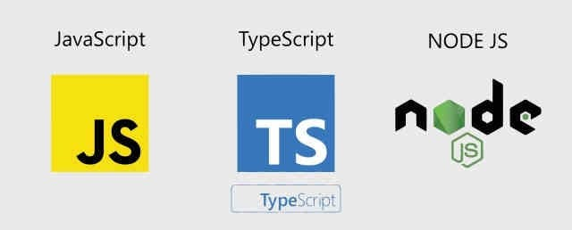

# alx-backend-javascript

---

---
This repository contains different javaScript and node code which are mostly used to implement backend concepts. it is provided by the alx software engineering to the alx students who specilized on backend web development.
## :pencil: **Author**
### :man: Yidnekachew Bantrga
- [Github](https://github.com/Yidne21)
- [Linkedin](https://www.linkedin.com/in/yidnekachew-bantrga-801376234/)
